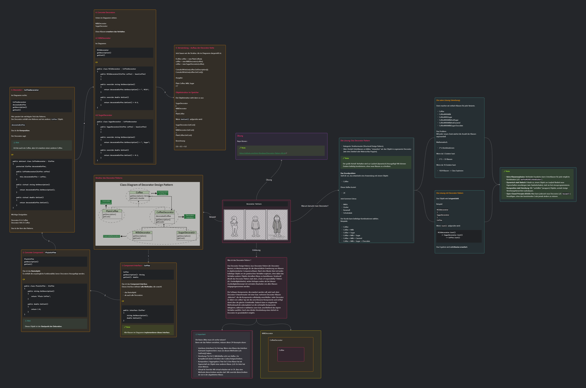

# Decorator-Pattern-AK

---
**Aufgabe 1:**

UML-Diagramm für das Pizza-Decorator-Programm

Erstellen Sie auf Basis des Pizza-Beispiels ein UML-Klassendiagramm für das vorhandene Pizza‑Programm.
Markieren und benennen Sie dabei die folgenden Hauptkomponenten des Decorator Patterns:

    Component Interface

    Concrete Component

    Decorator Base (bzw. Decorator Interface/Basisklasse)

    Concrete Decorators

---

**Aufgabe 2:**

Erweiterung des Pizza-Programms

Erweitern Sie das bestehende Pizza‑Programm um zwei weitere Decorators.
Passen Sie dazu sowohl den Code als auch – falls nötig – Ihr UML‑Diagramm aus Aufgabe 1 an.

---

**Aufgabe 3:**

Eigene Aufgabenstellung mit Decorator Pattern entwickeln

**Wir bilden 4 Gruppen.**

> [!NOTE]
> Jede Gruppe:
> 
>denkt sich ein eigenes, kleines Projekt aus, in dem das Decorator Pattern ähnlich wie beim Kaffee‑ oder Pizza‑Beispiel eingesetzt werden >kann
> 
>     formuliert dazu eine eigene, klare Programmieraufgabe (inkl. kurzer Beschreibung der Klassen/Decorator‑Idee).
> 
Anschließend tauschen die Gruppen ihre Aufgabenstellungen untereinander (z.B. Gruppe 1 löst die Aufgabe von Gruppe 2 usw.).
Jede Gruppe bearbeitet die erhaltene Aufgabe und stellt am Ende ihre Lösung kurz im Plenum vor.
